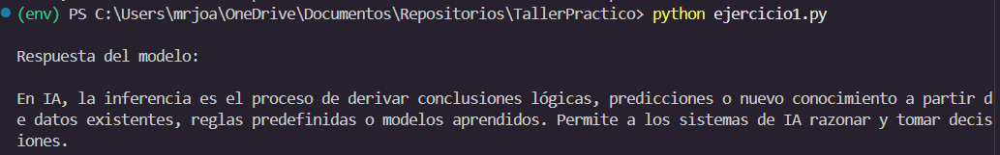
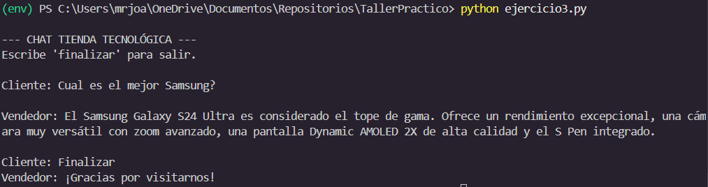

# Taller: Uso de Google Gemini API con Python

## Descripción

Este proyecto implementa un conjunto de scripts en Python utilizando la librería `google-genai` para interactuar con el modelo Gemini. El objetivo es demostrar la conexión con la API, el procesamiento inteligente de textos mediante roles definidos y la gestión de conversaciones interactivas con historial (Few-shot).

Se aplican buenas prácticas como el uso de variables de entorno para la API Key, configuración mediante `system_instruction` y diseño modular del código.

---

## Tecnologías utilizadas

- Python 3
- Librería `google-genai`
- python-dotenv
- Modelo Gemini 2.5 Flash

---

## Estructura del proyecto

```
taller-gemini/
│
├── ejercicio1_conexion.py
├── ejercicio2_procesador.py
├── ejercicio3_chat.py
├── requirements.txt
├── README.md
└── .env
```

---

## Ejercicio 1: Conexión y petición básica

Se inicializa el cliente de Gemini usando la API Key y se realiza una consulta simple para explicar qué es la inferencia en Inteligencia Artificial en menos de 50 palabras.

Se utiliza:
- Cliente `genai.Client`
- Configuración con `GenerateContentConfig`
- Control de longitud con `max_output_tokens`

Evidencia:



---

## Ejercicio 2: Procesador de textos inteligente

Se implementa la función:

```
procesar_articulo(texto, tarea)
```

Esta función permite realizar tareas editoriales como:

- Resumir
- Traducir
- Mejorar redacción
- Profesionalizar texto
- Adaptar tono

Se utiliza `system_instruction` para definir a la IA como un **Editor Editorial de prestigio**.

Además, se restringe el comportamiento del modelo para que solo realice tareas editoriales. Si se solicita algo fuera de este ámbito, responde con un mensaje de restricción.

Evidencia:


---

## Ejercicio 3: Chat de soporte con historial (Few-shot)

Se implementa un chat interactivo simulando un vendedor de tecnología.

Características:

- Uso de `system_instruction` para definir el rol de vendedor
- Historial precargado con ejemplos (Few-shot)
- Uso de roles `user` y `model`
- Bucle de conversación hasta que el usuario escriba "finalizar"
- Restricción para responder únicamente preguntas relacionadas con tecnología

Esto permite mantener el contexto y mejorar la calidad de las respuestas.

 Evidencia:



---

## Ejecución

Instalar dependencias:

```
pip install -r requirements.txt
```

Ejecutar scripts:

```
python ejercicio1_conexion.py
python ejercicio2_procesador.py
python ejercicio3_chat.py
```

---
